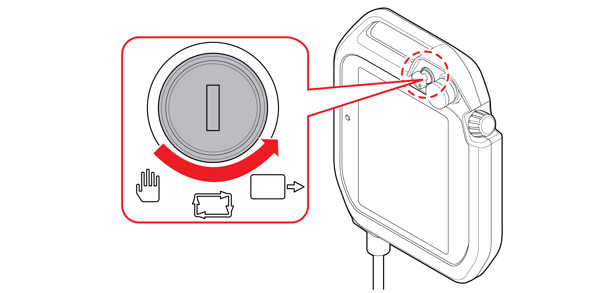
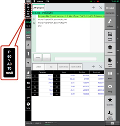
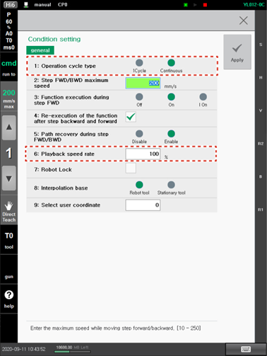

# 2.2.1 Operation Method

It is the method to teach the robot the contents of the work and then make it perform the work is as follows.

1.	Check whether there are people or obstacles within the safety fence and the operation range of the robot.

2.	Set the operation mode to automatic mode by turning the mode switch of the teach pendant.

3.	On the status bar of the Hi6 teach pendant screen, check whether the operation mode is set to automatic mode.

* If it is set to manual mode, turn the mode switch of the teach pendant to set the operation mode to automatic mode.

4.	Touch the \[Recording Condition\] button on the left side of the initial screen. Then, the condition setting window will appear.

5.	Set the program repetition option and robot operation speed.

* **\[1: Operation Cycle type\]:** You can set whether to repeat the program that will be executed during automatic operation.
* **\[6: Playback speed rate\]:** You can set the operation speed \(%\) of the robot when a program is played back in automatic mode.  
  For example, if the operation speed is set to 100, the robot will move at the recorded speed of the step, and if it is set to 50, the robot will move at the ratio of 50% of the recorded speed.
  ****

6.	Press the &lt;start&gt; key on the teach pendant. The start lamp will be turned on, and the robot will perform the work according to the created program.

