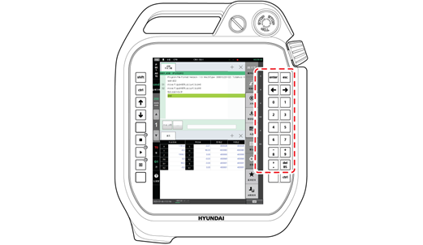

# 2.7.1 조그키

수동 모드에서 사용합니다. 모터가 켜진 상태에서 인에이블링 스위치를 잡고 있는 동안 티치 펜던트의 &lt;enter&gt;, &lt;esc&gt; 및 &lt;←/→&gt; 키와 숫자키는 ‘조그키’로 동작합니다.

* 각 키에 지정된 축의 이름은 디스플레이의 우측 가장자리의 조그 막대에 표시됩니다.
* 조작키의 우측 키는 증가\(+\), 좌측 키는 감소\(-\) 방향입니다.

조그 시 선택된 메커니즘이 메커니즘\[0\] 로봇인 경우에 한하여 다음 메커니즘\[1\]의 전체 축 개수가 2축 이하이면 등록된 부가축의 순서에 따라 각각 할당됩니다. 이때 메커니즘\[1\]에서 할당되지 않은 키가 남아 있고 그 다음 메커니즘이 잔여 키에 할당 가능한 축 개수 이내로 되어 있는 경우 순차적으로 할당됩니다.

예를 들어, 부가축 메커니즘의 축 개수에 따른 J7, J8축에 대한 할당 여부는 다음과 같습니다.

| 메커니즘\[0\] | 메커니즘\[1\] | 메커니즘\[2\] | J7축 / J8축 할당 여부 |
| :--- | :--- | :--- | :--- |
| 6축 로봇 | 주행축1 축 | 포지셔너 1축 | J7: 주행축 / J8: 포지셔너 |
| 6축 로봇 | 주행축1 축 | 포지셔너 2축 | J7: 주행축 / J8: 미할당 |
| 6축 로봇 | 주행축2 축 | 포지셔너 2축 | J7: 주행축 1 / J8: 주행축 2 |
| 6축 로봇 | 주행축3 축 | 포지셔너 1축 | J7: 미할당 / J8: 미할당 |

