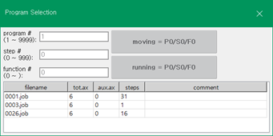

# 3.1 Program Management

While the robot is stopped, you can create, modify, and delete programs.

1.	In the JOB program window, touch the \<**PROG**\> key with <SHIFT>. Then, the program selection window will appear.

    

2.	You can create, modify, and delete programs.

* To add a new program, type the new program number and press <ENTER> key, referring to “[3.2 Program Writing](2-prog-edif/../2-prog-edit/README.md)”.

    

* To open a program to check and modify its contents, input the program number, or select a program from the list and then touch the \[OK\] button. Then, the selected program will be opened in the JOB program window.

* To delete a program, select the program from the list and press \<DEL> key. 

* You can also delete a program from the file list \(\[service &gt; 5: File Management\]\). For details, refer to “[4.2.1 File Management](../4-service/2-file-manager/1-file-management.md)”.
  
* You can quickly delete a program using the R code \(R117\). For details, refer to “[8.4 R117 for Deleting a Program](../8-r-code/4-r117.md)”.

