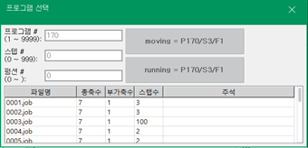

# 3.1 프로그램 관리

로봇이 정지된 상태에서, 프로그램을 생성, 수정 및 삭제할 수 있습니다.

1.	JOB 프로그램창에서 <**프로그램**> 키를 <**SHIFT**>와 함께 누르십시오. 프로그램 선택창이 나타납니다.

2.	프로그램을 생성, 수정 및 삭제하십시오.

* 새 프로그램을 추가하려면, 신규 프로그램 번호를 입력 후 엔터를 입력하십시오. “[3.2 프로그램 작성](2-prog-edif/../2-prog-edit/README.md)”을 참조하여 내용을 입력하십시오.

* 프로그램을 열어 내용을 확인하고 수정하려면, 프로그램 번호를 입력하거나 목록에서 프로그램을 선택한 후 \[확인\] 버튼을 터치하십시오. 선택한 프로그램이 JOB 프로그램창에서 열립니다.

* 프로그램을 삭제하려면, 파일 목록\(\[**서비스** &gt; 5: 파일관리\]\)에서 해당 프로그램을 선택한 후 삭제하십시오. 자세한 내용은 "[4.2.1 파일관리](../4-menu/2-file-manager/1-file-management.md)"를 참고하시기 바랍니다.

* 또한, R코드\(R117\)를 이용하여 프로그램을 빠르게 삭제할 수 있습니다. 자세한 내용은 “[8.4 R117 프로그램 삭제](../8-r-code/4-r117.md)”를 참조하십시오.

