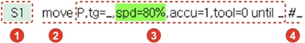

# 3.2.1 Statements

A general program consists of a step command that instructs the robot to move and a function command that instructs the robot to carry out work after the movement.

A statement is largely divided into a command and a parameter, which is an additional item. The parameters are divided into default parameters essential for a statement and optional parameters that can be omitted.

| No. | Description | No. | Description |
| :--- | :--- | :--- | :--- |
|   | Step number |   | Parameter |
|   | Command |   | Comment |


For details on parameters, refer to “[2.3.1 Step Statement Parameters](../../operation/step/step-cmd-param/).”


When you input a statement, basic setting values will be automatically inputted into the default parameters and can be changed. Optional parameters are marked with a symbol \( \_ \), and you can input the parameter values by selecting the parameters. Moreover, parameters that can be inputted will be displayed as buttons on the function button bar.

When editing the command parameters, you can edit variables, expressions, and strings by using the operation keys on the teach pendant and the menu buttons on the bottom of the screen, or by using the soft keyboard.

