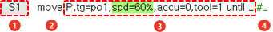
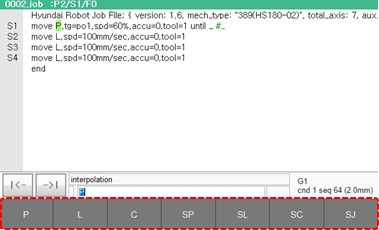

# 3.2.1 명령문

일반적인 프로그램은 로봇의 이동을 지시하는 스텝 명령문과 이동 후 작업을 지시하는 펑션 명령문으로 구성됩니다.

명령문은 크게 명령어와 부가 항목인 인수\(Parameter\)로 나뉘며 인수에는 명령문에 반드시 필요한 기본 인수와 생략 가능한 선택 인수가 있습니다.

| 번호 | 설명 | 번호 | 설명 |
| :--- | :--- | :--- | :--- |
|  | 스텝 번호 |  | 인수 |
|  | 명령어 |  | 주석 |


인수에 대한 자세한 내용은 “[2.3.1 스텝 명령문 인수](../../2-operation/3-step/1-step-cmd-param/README.md)”를 참조하십시오.


명령문을 입력하면 기본 인수에는 기본 설정값이 자동으로 입력되며 변경할 수 있습니다. 선택 인수는 기호\( \_ \)로 표시되며 이곳을 선택하면 인수값을 입력할 수 있습니다. 인수에 따라 화면 하단에 입력 가능한 인수가 버튼으로 나타납니다.

명령어 인수를 편집할 때는 티치 펜던트의 조작키와 화면 하단의 메뉴 버튼을 이용하거나 소프트 키보드를 이용하여 변수나 수식, 문자열을 편집할 수 있습니다.

<table>
  <tr>
    <td>내용</td>
    <td>내용</td>
  </tr>
  <tr>
    <td colspan="2">내용</td>
  </tr>
</table>

<table>
  <tr>
    <td rowspan="3">내용</td>
    <td>내용</td>
  </tr>
  <tr>
    <td>내용</td>
  </tr>
  <tr>
    <td>내용</td>
  </tr>
</table>