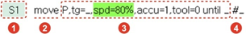
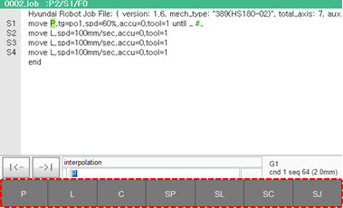

# 3.2.1 声明

一个一般程序由一个步骤命令组成，该命令指示机器人移动，以及一个功能命令，该命令指示机器人在移动后执行工作。

声明主要分为命令和参数，参数是附加项。参数分为声明所必需的默认参数和可以省略的可选参数。

| No. | 描述 | No. | 描述 |
| :--- | :--- | :--- | :--- |
|   | 步骤编号 |   | 参数 |
|   | 命令 |   | 注释 |


有关参数的详细信息，请参阅 "[2.3.1 步骤语句参数](../../operation/step/step-cmd-param/)."


当您输入声明时，基本设置值将自动输入到默认参数中，并可以更改。可选参数用符号 \( \_ \) 标记，您可以通过选择参数输入参数值。此外，可以输入的参数将在功能按钮栏上显示为按钮。

在编辑命令参数时，您可以使用教学手柄上的操作键和屏幕底部的菜单按钮，或使用软键盘编辑变量、表达式和字符串。