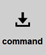
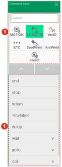

# 3.2.2.1 General Statement Inputting

1.	In manual mode, touch the \[Command\] button on the right side of the initial screen. Then, the command inputting window will appear.

2.	Touch a statement group or input command and then select the command from the list. The statement will be inputted immediately below the current cursor position.

* In the case of command with multiple parameter forms, a check mark \(\) will appear on the right. You can check and select the parameter form by touching the command in the list. 
* 
  For details on each statement, refer to the “[Hi6 Robot Language Function Manual](https://hrbook-asoe72.web.app/#/view/doc-hrscript/english/README).”
