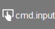
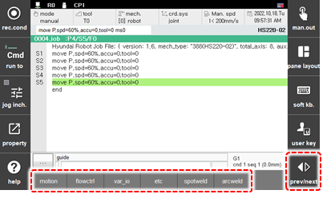

# 3.2.2.1 一般语句输入

1. 在手动模式下，触摸初始屏幕右下角的 `[cmd.input]` 按钮。然后，命令输入窗口将出现。

    

2. 触摸语句组，然后从列表中选择命令。语句将立即插入到当前光标位置下方。

    

* 如果命令列表中的命令超过七个，您可以通过触摸 [prev/next] 按钮查看更多命令。

* 有关每个语句的详细信息，请参阅 "[${cont_model} Robot Language Function Manual](https://hrbook-hrc.web.app/#/view/doc-hrscript/zh/README)。"