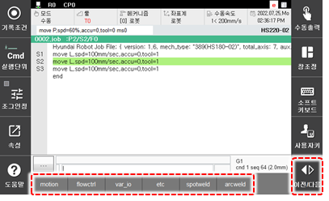

# 3.2.2.1 일반 명령문 입력

1.	수동 모드에서 초기 화면 하단의 \[명령입력\] 버튼을 터치하십시오. 명령 입력창이 나타납니다.

2.	명령문 그룹을 터치하거나 명령어를 입력한 후 목록에서 명령어를 선택하십시오. 현재 커서 위치의 바로 아래에 명령문이 입력됩니다.

* 한 그룹의 명령어가 많을 경우 [이전/다음] 버튼을 눌러서 추가 명령어를 확인하십시오.
* 각 명령문에 대한 자세한 내용은 "[Hi6 로봇제어기 기능설명서 - 로봇언어 HRScript](https://hrbook-hrc.web.app/#/view/doc-hrscript/korean/README)"를 참조하십시오.
