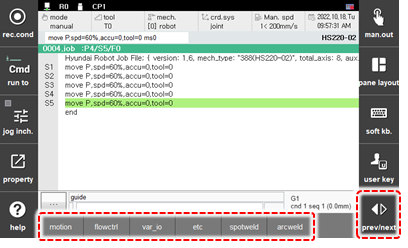

# 3.2.2.1 General Statement Inputting

1.	In manual mode, touch the \[cmd.input\] button on right bottom of the initial screen. Then, the command input window will appear.

    

2.	Touch a statement group and then select the command from the list. The statement will be inserted immediately below the current cursor position.

    

* If the command list has commands more than seven, you can see the additional command by touching [prev/next] button.

* For details on each statement, refer to the “[Hi6 Robot Language Function Manual](https://hrbook-hrc.web.app/#/view/doc-hrscript/english/README).”
