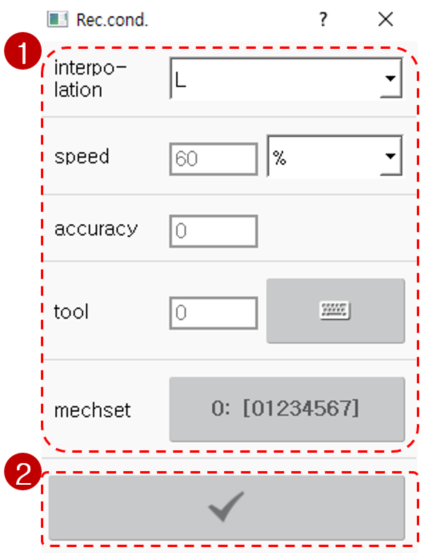
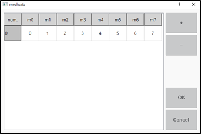

# 3.2.2.3 记录条件

当使用 `[REC]` 键输入语句时，机器人的当前姿态将被记录为目标姿态，并且通过 `[rec.cond]` 按钮提前设置的值将应用于移动命令 \(move\) 参数。以下显示了设置语句记录条件的方法。

1. 在 ${cont_model} 教 pendant 屏幕左侧触摸 `[rec.cond.]` 按钮。然后，将出现记录条件设置窗口。

    

2. 设置插值、移动速度和单位、精度以及工具编号后，触摸 `[check]` 按钮 \(\)。

    

* 当进行位置记录时，移动语句将根据记录条件设置进行记录。
* 在机制集设置中，可以指定在进行位置记录时要存储的机制配置。

    * 如果短暂触摸 `[mechsets]` 按钮，预定义的机制集编号将依次出现。
    * 如果长按 `[mechsets]` 按钮，可以在机制集设置窗口中修改现有集配置，或通过使用 `[+]` 或 `[-]` 按钮添加或删除机制集。

        