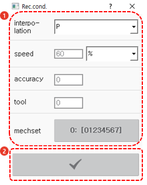
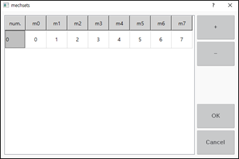

# 3.2.2.3 Recording Condition

When a statement is inputted using the \<REC\> key, the current posture of the robot will be recorded as the target pose, and the value set in advance using the \[rec.cond\] button will be applied to the move command \(move\) parameter. The following shows the method of setting the recording condition of a statement.

1.	Touch the \[Rec.cond.\] button on the left side of the Hi6 teach pendant screen. Then, the recording condition setting window will appear.

    

2.	After setting the interpolation, moving speed and unit, accuracy, and tool number, touch the \[OK\] button \(\).

    

* When position recording is performed, the move statement will be recorded based on the condition set in the recording condition.
* In the mechanism set, you can designate the configuration of the mechanism to be stored when position recording is performed.

    * If you briefly touch the \[mechsets\] button, the predefined mechanism set numbers will appear in sequence.
    * If you touch and hold the \[mechsets\] button, you can modify the existing set configuration in the Mechanism Set setting window, or add or delete a mechanism set by using the \[+\] or \[-\] button.

        

