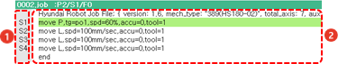
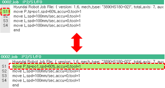

# 3.2.3 명령문 구성

명령문은 주소 영역과 명령문 영역으로 구성됩니다.

 

| 번호 | 영역 | 설명 |
| :--- | :--- | :--- |
|  | 주소 영역 | 행 번호\(1 ~ 9999\)와 스텝 번호 \(S1 ~ S999\)가 표시됩니다. |
|  | 명령문 영역 | 명령문이 표시됩니다. |

티치 펜던트의 &lt;←/→&gt; 키를 눌러 주소 영역과 명령문 영역 사이에서 커서의 위치를 이동할 수 있습니다. &lt;↓/↑&gt; 키를 누르면 선택된 영역 내의 행 사이에서 커서를 위아래로 이동할 수 있습니다.

