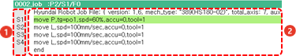
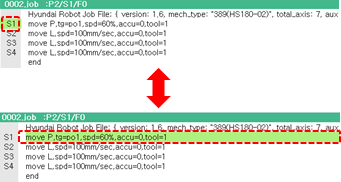

# 3.2.3 语句配置

一个语句由地址区域和语句区域组成。 

| No. | Area | Description |
| :--- | :--- | :--- |
|  | 地址区域 | 显示行号 \(1 到 9999\) 和步骤号 \(S1 到 S999\) |
|  | 语句区域 | 显示语句 |

您可以通过按下 `[←/→]` 键在地址区域和语句区域之间移动光标位置。按下 `[↓/↑]` 键将允许您在所选区域的行之间上下移动光标。

