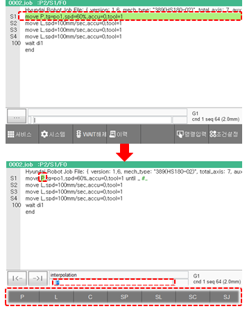
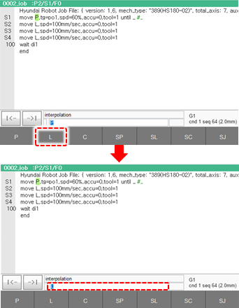
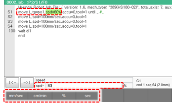

# 3.2.4.2 명령문 편집 예

보간 인수를 P \(축 보간\)에서 L \(직선 보간\)로 변경하는 것을 예로 들어, 명령문을 편집하는 방법에 대해 설명합니다.

1.	문장 커서 상태에서 티치 펜던트의 <<b>ENTER</b>> 키를 누르십시오. 단어 커서 상태가 되어 move 문의 보간 인수인 P \(축 보간\)가 선택됩니다. 입력 영역에는 보간의 현재 설정값인 P가 표시되고 입력 가능한 보간 인수가 화면 우측에 버튼으로 나타납니다.

2.	화면 우측의 버튼 중 \[L\] 버튼을 터치하십시오. 입력 영역에 L \(직선 보간\)이 표시됩니다. 

3.	<<b>ENTER</b>> 키를 누르십시오. 명령문의 보간 인수가 L로 변경되고 커서가 다음 인수로 이동하여 이동 속도가 선택됩니다.

4.	<<b>ENTER</b>> 키를 눌러 편집을 완료하십시오. 변경 내용이 JOB 프로그램에 저장되고 문장 커서 상태로 돌아갑니다.

