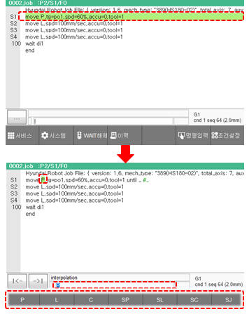
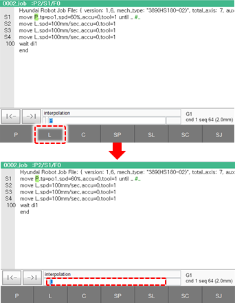
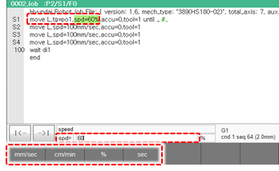

# 3.2.4.2 编辑语句的示例

以将插值参数从 P \(关节插值\) 更改为 L \(线性插值\) 的示例，以下描述了如何编辑语句。

1. 在语句光标状态下，按下 `[ENTER]` 键。然后，语句光标将变为单词光标状态，允许选择 P \(关节插值\)，这是移动语句的插值参数。在输入区域，将显示当前插值设置值 P，屏幕的功能按钮栏上将显示可以输入的插值参数作为按钮。

    

2. 在功能按钮栏中触摸 `[L]` 按钮。然后，输入区域将显示 L \(线性插值\)。

    

3. 按下 `[ENTER]` 键。语句的插值参数将更改为 L，然后光标将移动到下一个参数，允许选择移动速度。

    

4. 按下 `[ENTER]` 键以完成编辑。更改的内容将保存在 JOB 程序中，然后光标将返回到语句光标状态。