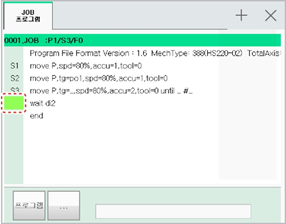
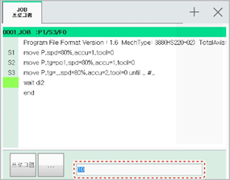

# 3.2.4.3 행 번호 편집 방법

행 번호는 1 ~ 9999 사이의 수로 설정할 수 있습니다.

1.	JOB 프로그램창에서 티치 펜던트의 &lt;←/→&gt; 키를 눌러 주소 영역을 선택하십시오. 주소 영역이 선택됩니다.

* 명령문 영역에서 문장 커서 상태일 경우 &lt;←&gt; 키를 누르면 커서가 주소 영역으로 이동할 수 있습니다. 

2.	주소 영역에서 &lt;↓/↑&gt; 키를 눌러 행을 선택한 후 행 번호를 편집하십시오.

* 행 번호를 입력하려면, 숫자키를 이용하여 입력 영역에 행 번호를 입력하십시오. 

* 행 번호를 삭제하려면, &lt;BS&gt; 키를 누르십시오. 입력 영역에서 행 번호의 주소값이 제거됩니다.

3.	&lt;enter&gt; 키를 눌러 편집을 완료하십시오. 변경 내용이 JOB 프로그램에 저장됩니다.
_assets

