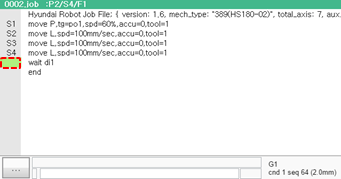
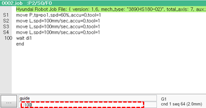
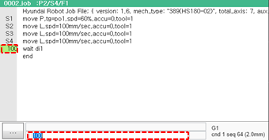

# 3.2.4.3 行号编辑方法

行号可以设置为1到9999之间的任何数字。

1. 在JOB程序窗口中，通过按下`[←/→]`键选择地址区域。然后，地址区域将被选中。

* 如果光标在语句区域处于语句光标状态，按下`[←]`键将光标移动到地址区域。

    

2. 在地址区域，通过按下`[↓/↑]`键选择一行，然后编辑行号。

* 输入行号时，请使用数字键在输入区域输入行号。

    

* 要删除行号，请按`[BS]`键。然后，行号的地址值将从输入区域中删除。

3. 按下`[ENTER]`键以完成编辑。更改的内容将保存在JOB程序中。

    