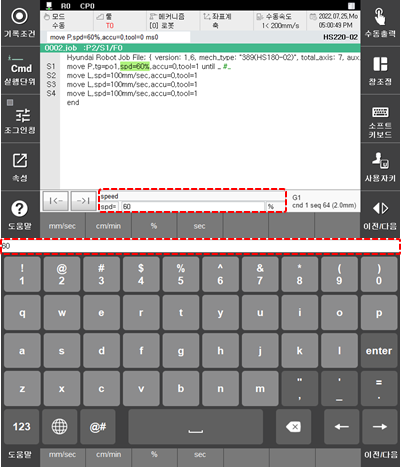
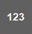

# 3.2.4.4 소프트 키보드

Hi6 티치 펜던트 화면의 소프트 키보드를 이용하여 변수나 수식, 문자열을 편리하게 입력합니다.

1.	Hi6 티치 펜던트 화면의 오른쪽 표시줄에서 \[\] 버튼을 터치하십시오. 화면 하단에 소프트 키보드가 나타납니다.

2.	소프트 키보드를 이용하여 입력 영역에 변수나 수식, 문자열을 입력하십시오. 기존의 인수값이 제거되고 입력한 텍스트가 표시됩니다.

* 입력 영역 좌측의 \[/\] 버튼을 터치하면, 커서의 위치를 이동하여 원하는 위치에 텍스트를 삽입할 수 있습니다.
* \[/\] 버튼을 터치하면 숫자와 기호 및 특수 문자를 입력할 수 있습니다.
* \[\] 버튼을 터치하면 입력 언어를 변경할 수 있습니다.
* 티치 펜던트의 &lt;shift&gt; 키를 누른 상태에서 키를 터치하면 대문자 및 기호를 입력할 수 있습니다.

3.	텍스트 편집을 완료하면, [enter] 버튼을 터치하십시오.

