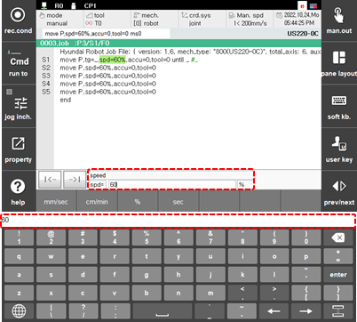
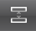

# 3.2.4.4 软件键盘

您可以通过 ${cont_model} 教学挂架屏幕上的软件键盘轻松输入变量、表达式和字符串。

1.	触摸 ${cont_model} 教学挂架屏幕日志栏上的  按钮。然后，屏幕底部将出现软件键盘。

2.	您可以在输入区使用软件键盘输入变量、表达式和字符串。现有的参数值将被移除，输入的文本将显示出来。

    

* 如果您触摸输入区域左侧的 / 按钮，您可以移动光标位置，从而在所需位置插入文本。

* 您可以通过触摸  按钮来更改输入语言。

* 您可以通过按住 `[SHIFT]` 键的同时触摸按键输入大写字母或符号。

* 您可以通过触摸  按钮将键盘移动到屏幕顶部。

3.	完成文本编辑后，您可以通过按 `[ENTER]` 键隐藏软件键盘。