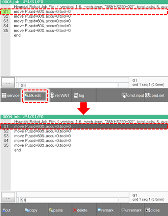
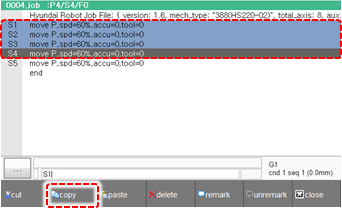
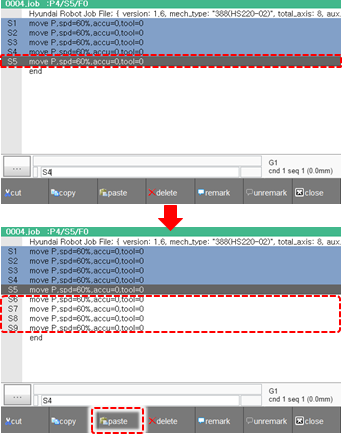

# 3.2.4.5 Block Editing Mode

You can copy, move, and delete a line or multiple lines of the program by designating it or them as a block.

1.	While pressing the <**SHIFT**> key on the teach pendant, touch the \[blk.edit\] button on the function button bar of the JOB program window. Then, the block editing mode will be activated.

2.	Place the cursor on the desired line using the &lt;↓/↑&gt; keys on the teach pendant and then press the <<b>ENTER</b>> key. Then, the line on which the cursor is placed will be selected as the start line of the block.

    

3.	Move the cursor by turning the jog dial on the teach pendant. Then, the section from the start line to the line to which the cursor is moved to will be selected as a block.

    

4.	You can edit the statement in the area that is selected as a block using buttons on the function button bar.

    

* \[cut\]: You can cut the area selected as a block and save it in the clipboard so that it can be pasted to another location.
* \[copy\]: You can copy the area selected as a block and save it in the clipboard so that it can be pasted to another location.
* \[paste\]: Paste the area saved in the clipboard to the desired location.

  To paste the statement saved in the clipboard, you should select the cursor position using the jog dial and then touch the \[paste\] button. Then, the statement will be inputted into the line right below the current cursor position.

* 
  \[delete\]: You can delete the selected area.

5.	When you complete editing a block, press the &lt;esc&gt; key on the teach pendant or touch the \[close\] button on the function button bar to exit the block editing mode.

