# 3.2.4.5 块编辑模式

您可以将程序的单行或多行设置为块，以执行复制、移动、删除和备注操作。
 

#### 1. 进入块编辑模式

在作业编辑面板中，使用左箭头键将光标移动到地址区域。
单击 `F2: Blk.edit` 按钮进入块编辑模式，光标将变为灰色。

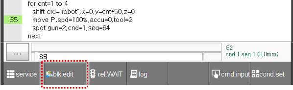
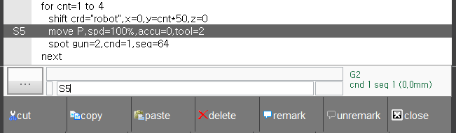
  

#### 2. 设置块

使用上下箭头键将光标移动到块的起始位置，然后按 `确认 (ENTER)` 键。接着，使用上下箭头键将光标移动到块的结束位置，并再次按 `确认 (ENTER)`。选定的块将以蓝色背景高亮显示。

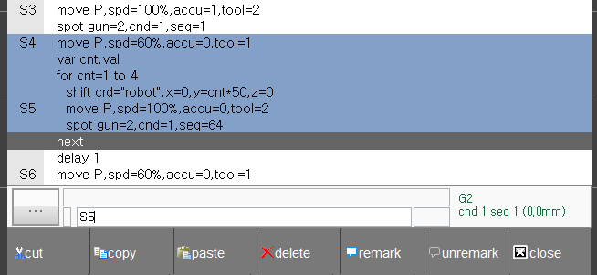

（如果在不移开光标的情况下执行复制或删除等操作，则不需要第二次按 `确认 (ENTER)`。）
  

#### 3. 复制

在块被选中时，单击 `F2: copy` 将内容复制到剪贴板。
或者，您可以在不选择块的情况下单击 `F2: copy` 仅复制一行。
  

#### 4. 粘贴

使用上下箭头键将光标移动到您希望粘贴的位置上方的行，然后单击 `F3: paste`。
例如，如果您希望将复制的块粘贴在 S1 中的 `delay 1` 语句下方，请将光标放在 `delay 1` 上，然后单击 `F3: paste`。

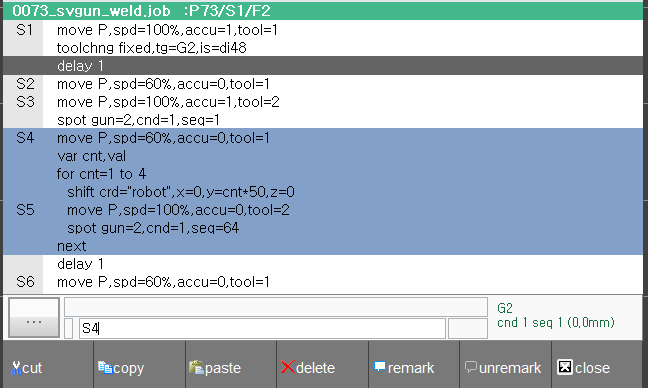
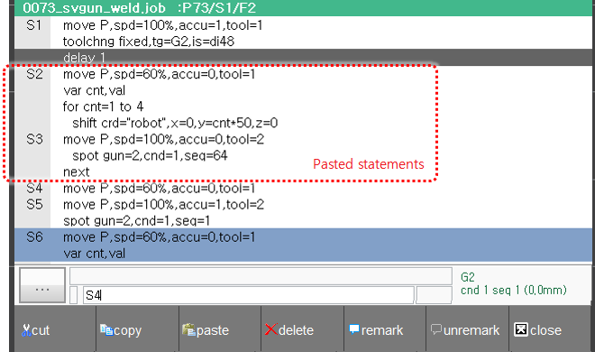
  

#### 5. 剪切

当选择块时，单击 `F1: cut` 将使块呈现浅灰色，表示该块已被剪切。  
或者，您可以在不选择块的情况下单击 `F1: cut` 来剪切一行。

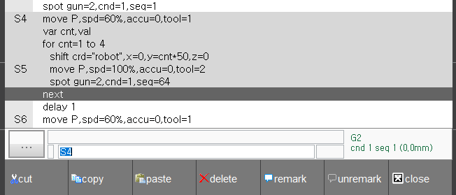

粘贴剪切块的方法与上述描述相同。
  

#### 6. 删除
当选择块时，单击 `F4: delete` 然后确认 `删除吗？ (Delete?)` 提示将删除该块。  
或者，您可以在不选择块的情况下单击 `F4: delete` 来删除一行。

 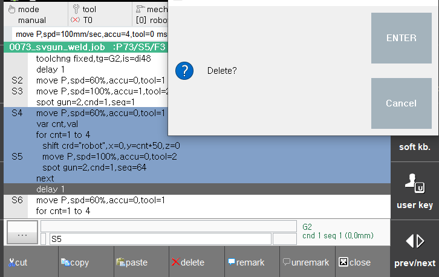
  

#### 7. 备注、取消备注

此功能用于暂时禁用作业程序中特定部分的执行而不删除它。  
当选择块并单击 `F5: remark` 时，块内的语句将被注释掉（备注）。
当选择块并单击 `F6: unremark` 时，注释将被移除（取消备注）。  
此外，您可以在不选择块的情况下注释或取消注释一行。


- 小于版本 V60.30-00 : 步骤未被备注。
- 版本 V60.30-00 及更高版本 : 步骤也被备注。


 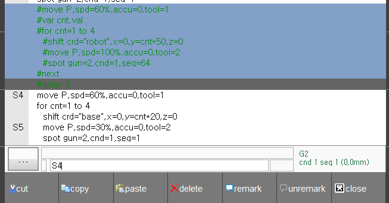
  

#### 8. 自动注释 / 移除注释

（此功能支持从版本 V70.02-00 及以后的版本。）

- 按 `[R5: Prev/next]` 按钮以显示 `[F1: 自动注释] ([F1: auto comment])` 和 `[F2: 取消注释] ([F2: uncomment])` 按钮。

- 当您按 `[F1: 自动注释] ([F1: auto comment])` 时，已注册的数据注释会自动插入到选定语句上。

  * 有关如何配置数据注释，请参见 [4.11 data comment](../../../4-service/11-data-cmts.md)。

  * 有关应用条件，请参阅 [4.3.9 Statement data comment](../../../4-service/3-program-conversion/9-stmt-comment.md) 部分。

- 当您按 `[F2: uncomments]` 时，所选语句的注释将被移除（无论是否注册数据）。

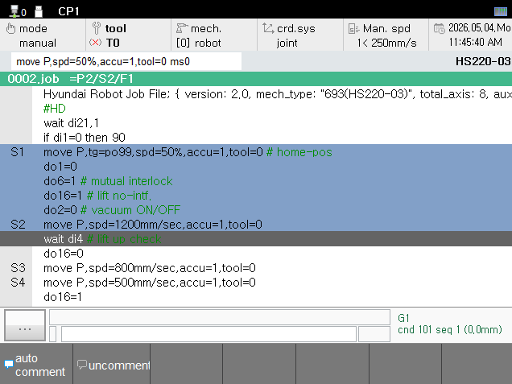

#### 9. 关闭块编辑模式

可以通过单击 `F7: close` 或按 `ESC` 键来关闭块编辑模式。
  

----

#### 自动调整步骤 #

例如，如果步骤 S1-S2 被复制并粘贴在下面，原本在 S3 的 `移动 (move)` 语句将由于插入的 2 步而被向下推，并重新编号为 S5。

在这种情况下，所有在同一作业中的跳转语句，例如 `goto`、`gosub`、`如果 (if)` 语句，以及 `等待 (wait)` 语句的目标地址的超时地址将会自动调整，从 S3 变为 S5。

例如，在下面的示例中，条件跳转语句 `if di45==0 then S3` 将被更新为 S5，以确保它仍然跳转到与之前相同的 `移动 (move)` 语句。

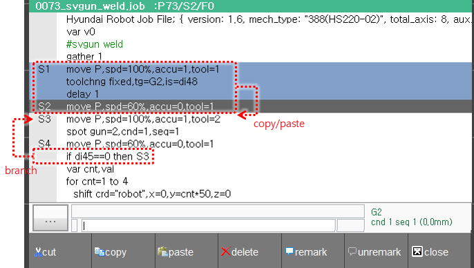
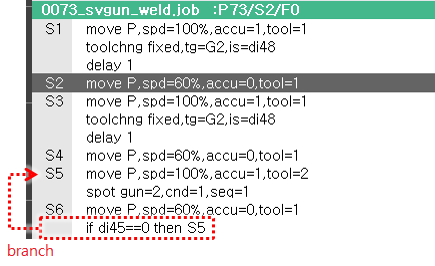

这种自动步号调整适用于向前或向后移动步号的操作，例如记录、删除和块编辑。


以下规格适用于版本 V60.30-00 及更高版本。


如果由于删除或备注而移除目标步骤，则将其调整为 `deleted_step#` 或 `remarked_step#`，如下所示。  
请手动将这些修改的目标地址调整为适当的步骤号码（或行号/标签）。
（如果不作更改，执行语句时将发生语法错误。）

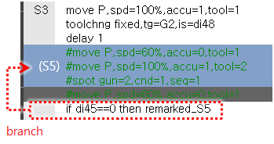