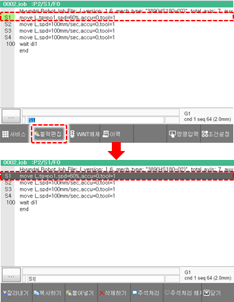
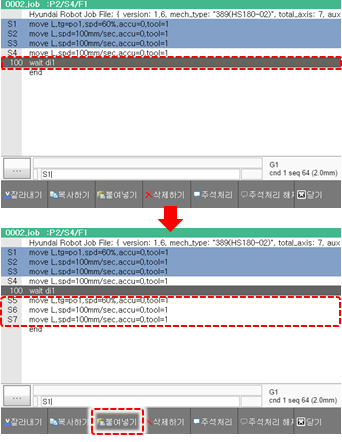

# 3.2.4.5 블록 편집 모드

프로그램의 한 행 또는 여러 행을 블록\(Block\)으로 지정하여 복사, 이동 및 삭제합니다.

1.	티치 펜던트의 방향키로 좌측 주소영역으로 커서를 이동하면 하단 \[블록편집\] 버튼이 활성화 됩니다. 버튼을 누르면 블록편집 모드가 활성화됩니다.

2.	티치 펜던트의 &lt;↓/↑&gt; 키로 원하는 행에 커서를 두고 &lt;enter&gt; 키를 누르십시오. 커서가 위치한 행이 블록의 시작행으로 선택됩니다. 

3.	티치 펜던트의 방향키로 커서를 이동하십시오. 시작행부터 커서를 이동시킨 행까지 블록으로 선택됩니다. 

4.	화면 하단의 기능 버튼을 이용하여 블록으로 선택한 영역의 명령문을 편집하십시오. 

* \[잘라내기\]: 블록으로 선택한 영역을 잘라내어 다른 위치에 붙여 넣을 수 있도록 클립보드에 저장합니다.  
* \[복사하기\]: 블록으로 선택한 영역을 복사하여 다른 위치에 붙여 넣을 수 있도록 클립보드에 저장합니다.  
* \[붙여넣기\]: 클립보드에 저장한 영역을 원하는 위치에 붙여 넣습니다. 클립보드에 저장된 명령문을 붙여 넣으려면, 방향키로 커서의 위치를 선택한 후 \[붙여넣기\] 버튼을 터치하십시오. 현재 커서 위치 바로 아래 행에 명령문이 입력됩니다.  
* \[삭제\]: 선택 영역을 삭제합니다.

 

5.	블록 편집을 완료하면, 티치 펜던트의 &lt;esc&gt; 키를 누르거나 화면 우측의 \[닫기\] 버튼을 터치하여 블록편집 모드를 종료하십시오.

