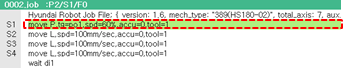
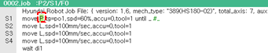

# 3.2.4 Statement Editing

You can edit the statement in the JOB program window using the operation keys on the teach pendant and the menu buttons on the function button bar. Using the soft keyboard, you can edit variables, expressions, and strings.

In the statement area, you can check and edit statements by switching the status of the cursor according to the selected object.

* Statement cursor Status: You can check a statement while the entire line of the statement is selected.

    

* Word cursor Status: You can check and edit a statement while the individual parameters of the statement are selected.

    

