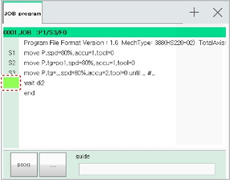
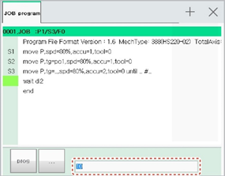
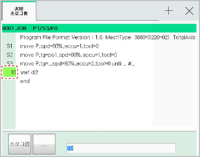

# 3.2.4.3 Line Number Editing Method

The line number can be set to any number between 1 and 9999.

1.	In the JOB program window, select the address area by pressing the &lt;←/→&gt; key on the teach pendant. Then, the address area will be selected.

* If the cursor is in the statement cursor status while in the statement area, press the &lt;←&gt; key to move the cursor to the address area.

2.	In the address area, select a line by pressing the &lt;↓/↑&gt; key and then edit the line number.

* To input a line number, input the line number in the input area using the number keys.

* To delete a line number, press the &lt;BS&gt; key. Then, the address value of the line number will be removed from the input area.

3.	Press the &lt;enter&gt; key to complete the editing. The contents of the change will be saved in the JOB program.
_assets

