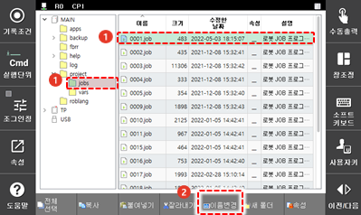
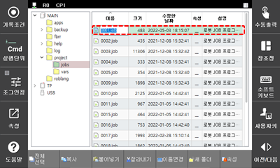

# 4.2.2 파일명 및 폴더명 변경

파일 또는 폴더의 이름을 변경합니다.

1.	파일\(또는 폴더\) 목록에서 원하는 파일\(또는 폴더\)을 터치하여 선택한 후 화면 하단에서 \[이름변경\] 버튼을 터치하십시오.

2.	입력 영역에 파일\(또는 폴더\) 이름을 입력하십시오.

* 숫자는 티치 펜던트의 조작 키를 이용해 간단히 입력할 수 있습니다. (커서 이동, 숫자키: 숫자 입력)
* 숫자를 포함한 텍스트를 입력하려면 이력 표시줄의 \[\] 버튼을 터치하여 소프트 키보드를 이용하십시오.

3.	&lt;enter&gt; 키를 누르십시오. 목록에 입력한 이름으로 변경되어 나타납니다.


* 보호 설정된 파일도 이름을 변경할 수 있습니다.
* 파일의 이름을 변경해도 크기, 수정 날짜, 속성 등의 정보는 기존과 동일하게 유지됩니다.
* R코드의 “R116 프로그램 번호 변경”과 동일한 기능입니다.


