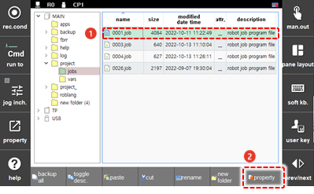
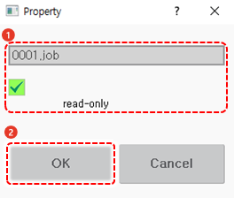

# 4.2.4 File Protection

Protect your important files by performing a setting that can make it impossible to change or delete a program.

1.	Select the file and touch the \[property\] button. Then, the attribute setting window will appear.

    

2.	Check the file name and touch the \[Read Only\] checkbox to select it and then touch the \[OK\] button. A protection mark \(W\_\) will appear in the attributes of the file list.

    

