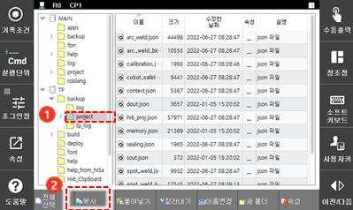
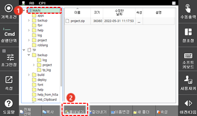
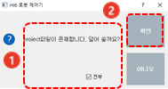

# 4.2.6 데이터 복원

백업 프로젝트\(project/\) 및 이력\(log/\)을 복원합니다.

1.	폴더 목록의 티치 펜던트\(T/P\) 또는 이동식 저장 장치\(USB\)에서 티치 펜던트의 방향키를 이용해 프로젝트 또는 이력이 백업된 폴더를 선택한 후 화면 우측의 \[복사\] 버튼을 터치하십시오.

2.	폴더 목록에서 티치 펜던트의 방향키를 이용해 \[MAIN\]을 선택한 후 화면 우측의 \[붙여넣기\] 버튼을 터치하십시오. 

3.	중복 알림창에서 \[전부\] 체크박스를 터치하여 선택한 후 \[확인\] 버튼을 터치하십시오. 메인 보드에 백업 데이터가 복원됩니다.

 4.	제어기의 전원을 다시 켜십시오.

