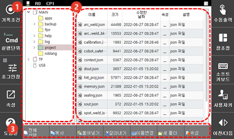

# 4.2    파일 관리

메인 보드의 내부 메모리 또는 티치 펜던트나 이동식 저장 장치의 파일을 관리합니다.

1. \[5: 파일관리\] 메뉴를 터치하십시오. 장치별 폴더 목록과 선택한 폴더에 저장된 파일의 목록이 나타납니다.
2. 장치별 폴더 구조와 저장된 파일을 확인하고 관리하십시오.

<table>
  <thead>
    <tr>
      <th style="text-align:left">번호</th>
      <th style="text-align:left">설명</th>
    </tr>
  </thead>
  <tbody>
    <tr>
      <td style="text-align:left">
        
      </td>
      <td style="text-align:left">
        <li> 메인 보드의 내부 메모리, 티치 펜던트, 이동식 저장 장치의 폴더 목록입니다. 폴더 구조를 확인할 수 있습니다.</li>
        <li> [MAIN]: 메인 보드(M/B)에 저장된 파일은 실제 로봇의 동작에 사용됩니다.</li>
        <li> [TP] / [
          USB]: 티치 펜던트(T/P)와 이동식 저장 장치(USB)는 데이터 백업 시 사용합니다. [
          USB] 폴더는 티치 펜던트에
          이동식 저장 장치가 연결된 경우에만 나타납니다.</li>
        <li> 티치 펜던트의 방향키로 폴더 목록에서 커서를 이동할 수 있습니다.</li>
        <li> 폴더 목록에서 [] 또는 [
          ]를 선택한 후 <<b>ENTER</b>> 키를 누르면 하위 폴더를 표시하거나 숨길 수 있습니다.</li>
        <li> 폴더를 선택하면 폴더에 저장된 파일의 목록을 확인할 수 있습니다.</li>
      </td>
    </tr>
    <tr>
      <td style="text-align:left">
        
      </td>
      <td style="text-align:left">선택한 폴더에 저장된 파일의 목록입니다. 파일별로
        이름과 크기, 최종 수정 날짜, 보호 여부, 추가 정보를 확인할 수 있습니다.</td>
    </tr>
    <tr>
      <td style="text-align:left">
        
      </td>
      <td style="text-align:left">기능 버튼을 이용해 파일과 폴더를 관리할 수 있습니다.</td>
    </tr>
  </tbody>
</table>


* R코드의 “R17 파일 관리”와 동일한 기능입니다.
* 이동식 저장 장치를 티치 펜던트에 연결하면 Hi6 티치 펜던트 화면의 상태 표시줄에 \[USB\] 아이콘\(\)이 나타납니다.



파일을 복사하거나 삭제하는 등의 동작을 수행하는 도중에 티치 펜던트에서 이동식 저장 장치를 절대 분리하지 마십시오. 데이터가 손상될 수 있습니다.


