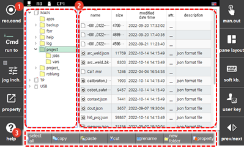

# 4.2 File Management

You can manage files in the main board’s internal memory, teach pendant, or removable storage device.

1.	Touch the \[5: File Manager\] menu. Then, a list of folders of each device and a list of files saved in the selected folder will appear.

2.	Check and manage the folder structure and saved files by device.

    

<table>
  <thead>
    <tr>
      <th style="text-align:left">No.</th>
      <th style="text-align:left">Description</th>
    </tr>
  </thead>
  <tbody>
    <tr>
      <td style="text-align:left">
        
      </td>
      <td style="text-align:left">
        
This is a list of folders in the main board&#x2019;s internal memory,
          teach pendant, and removable storage devices. You can check the folder
          structure.

        <ul>
          <li>[_assets
            MAIN]: The files saved in the mainboard (M/B) will be used for the actual
            robot operation.</li>
          <li>[_assets
            TP] / [
            USB]: The teach pendant (T/P) and a removable storage device (USB) will
            be used for data_assets>[</b>
            <b>USB]</b> folder will appear only when a removable storage device is
            connected to the teach pendant.</li>
          <li>You can move the cursor in the folder list by turning the jog dial on
            the teach pendant.</li>
          <li>If you select _assets
            ] or [
            ] in the folder list and press the <b>&lt;enter&gt;</b> key, you can show
            or hide subfolders.</li>
          <li>When you select a folder, you can check the list of files saved in the
            folder.</li>
        </ul>
      </td>
    </tr>
    <tr>
      <td style="text-align:left">
        
      </td>
      <td style="text-align:left">Shows the list of the files saved in the selected folder. You can check
        the name, size, last modified date, protected status, and additional information
        of each file.</td>
    </tr>
    <tr>
      <td style="text-align:left">
        
      </td>
      <td style="text-align:left">You can manage files and folders using the function buttons.</td>
    </tr>
  </tbody>
</table>


* It is the same function as “R17 File Management” of R codes._assets
* When a removable storage device is connected to the teach pendant, the \[USB\] icon \(\) will appear on the status bar of the Hi6 teach pendant screen.



Never remove the removable storage device from the teach pendant while performing operations such as copying or deleting files. Data may be corrupted.


