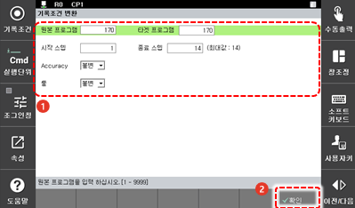

# 4.3.1 기록 조건

프로그램의 특정 스텝에 기록 조건을 변경 설정하여 기존의 프로그램에 적용하거나 새 프로그램을 생성합니다.

1.	\[6: 프로그램 변환 &gt; 1: 기록조건\] 메뉴를 터치하십시오. 기록 조건 변환 설정창이 나타납니다.

2.	기록 조건 옵션을 설정한 후 \[OK\] 버튼을 터치하십시오.

* \[원본 프로그램\]/\[타겟 프로그램\]: 기록 조건을 변경할 원본 프로그램의 번호\(초기 설정값: 현재 선택된 프로그램\)와 기록 조건을 변경한 후 저장할 새 프로그램의 번호를 입력합니다. 대상 프로그램 번호를 원본 프로그램과 같은 번호로 설정하면 원본 프로그램이 덮어쓰기 되어 새 프로그램으로 대체됩니다.
* \[시작 스텝\]/\[종료 스텝\]: 기록 조건을 변경 적용할 스텝의 범위\(초기 설정값: 1 / 마지막 스텝\)를 설정합니다.
* \[Accuracy\], \[툴\]: 기록 조건을 변경합니다.

