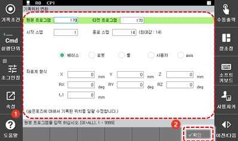

# 4.3.3 기록 위치

프로그램의 특정 스텝에 숨은 포즈로 기록된 스텝 위치의 좌표계를 변경 설정하여 기존의 프로그램에 적용하거나 새 프로그램을 생성합니다.
1.	[6: 프로그램 변환 > 3: 기록위치] 메뉴를 터치하십시오. 기록 위치 변환 설정창이 나타납니다.
2.	기록 위치 옵션을 설정한 후 [**확인**] 버튼을 터치하십시오.
 
  

* [원본 프로그램]/[타겟 프로그램]: 기록 위치를 변경할 원본 프로그램의 번호(초기 설정값: 현재 선택된 프로그램)와 기록 위치를 변경한 후 저장할 새 프로그램의 번호를 입력합니다. 대상 프로그램 번호를 원본 프로그램과 같은 번호로 설정하면 원본 프로그램이 덮어쓰기 되어 새 프로그램으로 대체됩니다.
* [시작 스텝]/[종료 스텝]: 기록 위치를 변경 적용할 스텝의 범위(초기 설정값: 1 / 마지막 스텝)를 설정합니다.
* [좌표계 형식]: 스텝에 기록된 위치 데이터를 변환(shift)할 좌표계를 선택합니다. 베이스, 로봇, 툴, 사용자 선택 시, 직교 좌표값으로 변환하고, 축 선택 시 축 각도로 변환합니다.
