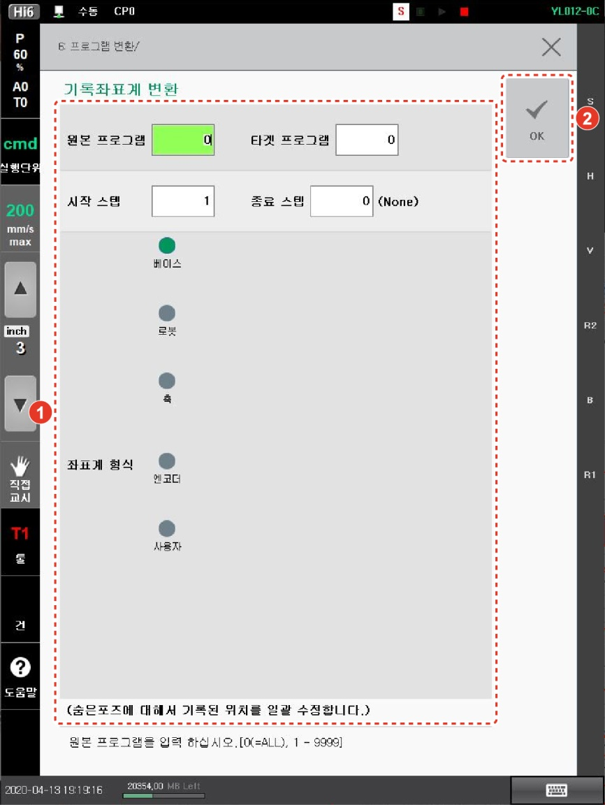

# 4.3.4 기록 좌표계

숨은 포즈로 기록된 스텝 위치의 좌표계를 변경합니다. 해당 스텝에서 퀵오픈 버튼을 누르면 변경된 좌표계를 확인할 수 있습니다. 로봇 기동 중에는 [4: 기록좌표계] 메뉴의 사용이 제한됩니다.
1.	[6: 프로그램 변환 > 4: 기록좌표계] 메뉴를 터치하십시오. 기록 좌표계 변환 설정창이 나타납니다.
2.	기록 좌표계 옵션을 설정한 후 [OK] 버튼을 터치하십시오.
 
   

* [원본 프로그램]/[타겟 프로그램]: 기록 좌표계를 변경할 원본 프로그램의 번호(초기 설정값: 현재 선택된 프로그램)와 기록 좌표계를 변경한 후 저장할 새 프로그램의 번호를 입력합니다. 대상 프로그램 번호를 원본 프로그램과 같은 번호로 설정하면 원본 프로그램이 덮어쓰기 되어 새 프로그램으로 대체됩니다.
* [시작 스텝]/[종료 스텝]: 기록 좌표계를 변경 적용할 스텝의 범위(초기 설정값: 1 / 마지막 스텝)를 설정합니다.
* [좌표계 형식]: 새로 지정할 좌표계를 선택합니다.
