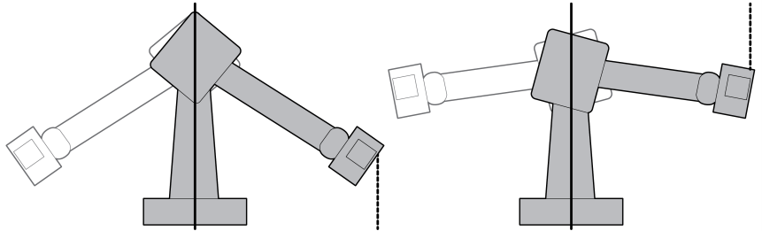
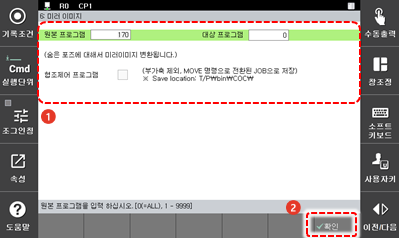

# 4.3.6 미러 이미지

로봇의 S축 0° 위치에서 Y-Z 평면을 기준으로 S축 위치와 손목축의 자세가 대칭인 프로그램을 작성합니다.
이 기능은 자동차의 본체 용접과 같이 좌우 두 대의 로봇에 동일한 작업을 지시할 때 유용합니다. 먼저 한 대의 로봇에 작업을 티칭한 후 다른 한 대의 로봇에는 티칭한 작업의 프로그램을 열고 미러 이미지로 변환하면 S축에 대칭인 프로그램이 작성됩니다.

   
 
 

협동로봇에는 미러 이미지 기능을 지원하지 않습니다.
로봇 기동 중에는 [6: 미러 이미지] 메뉴의 사용이 제한됩니다. 미러 이미지 기능을 사용하는 방법은 다음과 같습니다.


1.	[6: 프로그램 변환 > 6: 미러 이미지] 메뉴를 터치하십시오. 미러 이미지 설정창이 나타납니다.
2.	미러 이미지 변환 옵션을 설정한 후 [확인] 버튼을 터치하십시오.

* [원본 프로그램]/[대상 프로그램]: 기존 프로그램 번호와 미러 이미지로 변환하여 생성할 새 프로그램 번호를 설정합니다.

   