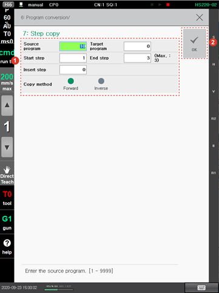

# 4.3.7 Step Copy

You can copy part of a program to another program or the same program. The functions recorded in the step will also be copied. During the startup of the robot, the use of the \[7: Step Copy\] menu will be restricted.

1.	Touch the \[6: Program Conversion &gt; 7: Step Copy\] menu. The step copying setting window will appear.

2.	After setting the step copying option, touch the \[OK\] button.

* \[Source program\]/\[Target program\]: You can set the number of the original program of which you want to copy the step and the number of the new program that you want to create by pasting the copied step. If you set the target program number as the same number as the original program number, the original program will be overwritten by and replaced with the new program.
* \[Start Step\]/\[End Step\]: You can set the range of steps that you want to copy \(Initial setting value: 1/last step\).
* \[Insert Step\]: You can set the reference step to which you want to paste the copied step. The copied step will be pasted right after the reference step.
* \[Copy Method\]: You can select the progress direction of the copied step.
  * \[Forward/Inverse\]: You can paste the copied steps in the same order as the original program or the reverse order of the original program.


* You cannot copy a protected program.
* If the END function is recorded in the copied step, the function will be copied together. Delete the function when necessary.
* If a function that makes it possible to jump \(GOTO, GOSUB\) to a step outside the copied range is recorded in the copied step, the function will be copied, but the number will not be changed automatically. Please change the number after copying.


