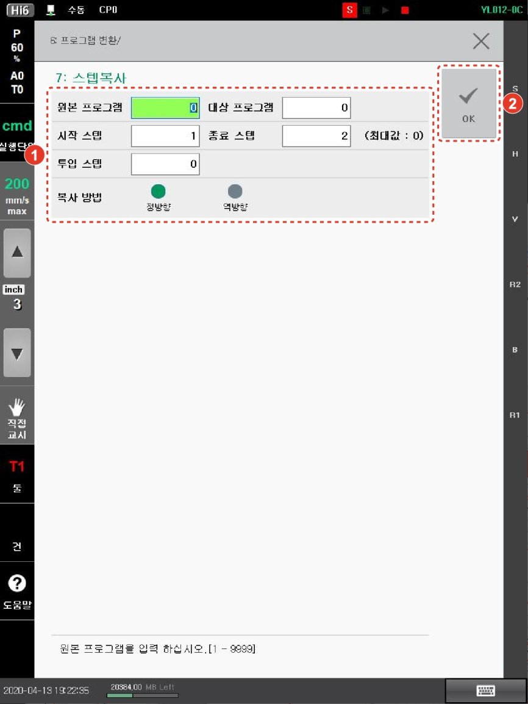

# 4.3.7 스텝 복사

프로그램의 일부를 다른 프로그램 또는 동일 프로그램으로 복사합니다. 스텝에 기록된 펑션(기능)도 함께 복사됩니다. 로봇 기동 중에는 [7: 스텝복사] 메뉴의 사용이 제한됩니다.

1.	[6: 프로그램 변환 > 7: 스텝복사] 메뉴를 터치하십시오. 스텝 복사 설정창이 나타납니다.
2.	스텝 복사 옵션을 설정한 후 [OK] 버튼을 터치하십시오
 
   

* [원본 프로그램]/[대상 프로그램]: 스텝을 복사할 원본 프로그램 번호와 복사한 스텝을 붙여 넣어 생성할 새 프로그램 번호를 설정합니다. 대상 프로그램 번호를 원본 프로그램과 같은 번호로 설정하면 원본 프로그램이 덮어쓰기 되어 새 프로그램으로 대체됩니다.
* [시작 스텝]/[종료 스텝]: 복사할 스텝의 범위(초기 설정값: 1/마지막 스텝)를 설정합니다.
* [투입 스텝]: 복사한 스텝을 붙여 넣을 기준 스텝을 설정합니다. 복사한 스텝은 기준 스텝 바로 다음에 붙여 넣기됩니다.
* [복사 방법]: 복사한 스텝의 진행 방향을 선택합니다.
* [정방향]/[역방향]: 복사한 스텝이 원본 프로그램과 동일한 순서 또는 원본 프로그램의 역순으로 붙여 넣기됩니다.


* 보호 설정된 프로그램은 복사할 수 없습니다.
* 복사한 스텝에 END 기능이 기록된 경우, 기능이 함께 복사됩니다. 필요에 따라 기능을 삭제하십시오.
* 복사한 스텝에 복사 범위를 벗어난 스텝으로 점프(GOTO, GOSUB)하는 기능이 기록된 경우, 기능은 복사되지만 번호는 자동으로 변경되지 않습니다. 복사 후 번호를 변경하십시오.

