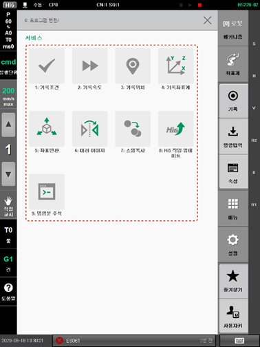

# 4.3 프로그램 변환

작성된 프로그램의 조건 및 위치 등을 일괄 또는 개별적으로 수정하거나 좌표를 변환하여 새 프로그램을 작성합니다.

1.	\[6: 프로그램 변환\] 메뉴를 터치하십시오. 프로그램 변환 메뉴가 나타납니다.

2.	원하는 메뉴를 선택하여 프로그램의 조건 및 위치 등을 수정하거나 새 프로그램을 작성하십시오.


로봇 기동 중에는 \[4: 기록좌표계\], \[5: 좌표변환\], \[6: 미러 이미지\], \[7: 스텝복사\] 메뉴의 사용이 제한됩니다.


