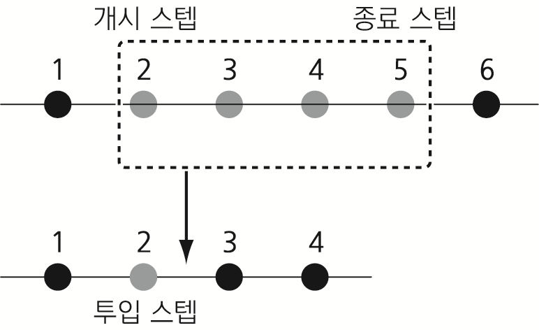
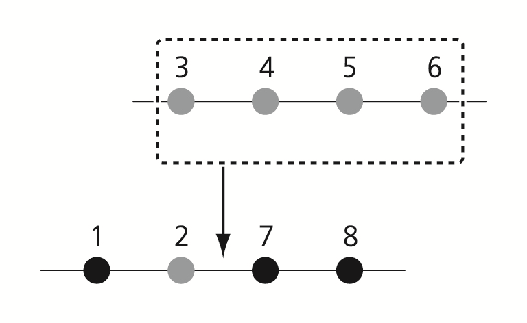
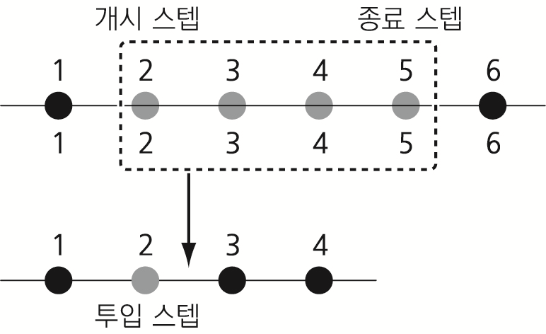
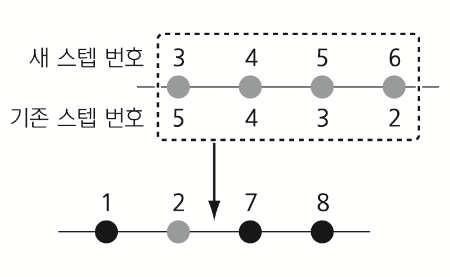

# 4.3.7.1 스텝 복사 예

프로그램1의 스텝2 ~ 스텝5를 프로그램2의 스텝2\(투입 스텝으로 설정\)에 정방향과 역방향으로 복사합니다.

대상 프로그램\(프로그램2\)의 투입 스텝\(스텝2\) 바로 다음에 원본 프로그램\(프로그램1\)의 스텝2 ~ 스텝5가 정방향\(원본 프로그램과 동일한 순서\) 또는 역방향\(원본 프로그램의 역순\)으로 삽입됩니다.

<table>
  <thead>
    <tr>
      <th style="text-align:left">방법</th>
      <th style="text-align:left">절차</th>
      <th style="text-align:left"></th>
      <th style="text-align:left">상세 과정</th>
    </tr>
  </thead>
  <tbody>
    <tr>
      <td style="text-align:left">정방향</td>
      <td style="text-align:left">복사 전</td>
      <td style="text-align:left">
        
원본 프로그램

        
(프로그램1)

        
▼

        
▼

        
대상 프로그램

        
(프로그램2)

      </td>
      <td style="text-align:left">
        
      </td>
    </tr>
    <tr>
      <td style="text-align:left"></td>
      <td style="text-align:left">복사 결과</td>
      <td style="text-align:left">프로그램2</td>
      <td style="text-align:left">
        
      </td>
    </tr>
    <tr>
      <td style="text-align:left">역방향</td>
      <td style="text-align:left">복사 전</td>
      <td style="text-align:left">
        
원본 프로그램

        
(프로그램1)

        
▼

        
▼

        
대상 프로그램

        
(프로그램2)

      </td>
      <td style="text-align:left">
        
      </td>
    </tr>
    <tr>
      <td style="text-align:left"></td>
      <td style="text-align:left">복사 결과</td>
      <td style="text-align:left">프로그램2</td>
      <td style="text-align:left">
        
      </td>
    </tr>
  </tbody>
</table>

