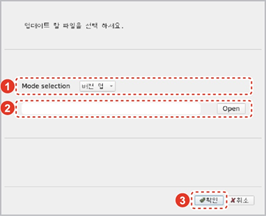
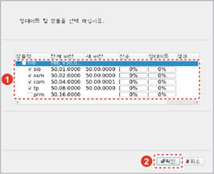

# 4.4.1.1 제어기 시스템 업데이트

통합 압축 파일을 이용하여 제어기 각 모듈의 버전을 업데이트합니다.

1.	통합 압축 파일이 저장된 이동식 저장 장치를 티치 펜던트의 USB 슬롯에 연결하십시오. 티치 펜던트에 이동식 저장 장치가 연결되면 제목 표시줄에 \[USB\] 아이콘\(\)이 나타납니다.

2.	시스템 환경 설정창 우측의 \[**버전업**\] 버튼을 터치하십시오. 버전업 프로그램 실행창이 나타납니다.

3.	드롭다운 메뉴를 터치하여 \[버전 업\] 모드를 선택하고 \[**Open**\] 버튼을 이용하여 통합 압축 파일을 선택한 후 \[**확인**\] 버튼을 터치하십시오. 

4.	업데이트할 모듈을 선택한 후 \[**확인**\] 버튼을 터치하십시오. 업데이트가 시작됩니다. 

5.	업데이트가 완료되면 \[**확인**\] 버튼을 터치하십시오. 버전업 프로그램 실행창이 닫히고 제어기가 자동으로 재시작합니다.

