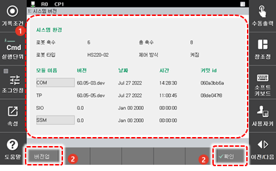

# 4.4.1 시스템 버전

\[7: 시스템 진단 &gt; 1: 시스템 환경\] 메뉴를 터치하십시오. 시스템 환경 설정창이 나타납니다.

1. 로봇과 제어기의 시스템 환경 정보를 확인하고 관리하십시오.

<table>
  <thead>
    <tr>
      <th style="text-align:left">번호</th>
      <th style="text-align:left">설명</th>
    </tr>
  </thead>
  <tbody>
    <tr>
      <td style="text-align:left">
        
      </td>
      <td style="text-align:left">로봇과 제어기의 시스템
        환경(소프트웨어 버전)
        정보입니다.</td>
    </tr>
    <tr>
      <td style="text-align:left">
        
      </td>
      <td style="text-align:left">
        
기능 버튼을 이용해 시스템
          환경을 편집하고 관리합니다.

        <ul>
          <li>[확인]: 변경 내용을 저장합니다.</li>
          <li>[버전업]: 제어기 각 모듈의
            버전을 업데이트합니다.</li>
        </ul>
      </td>
    </tr>
  </tbody>
</table>

