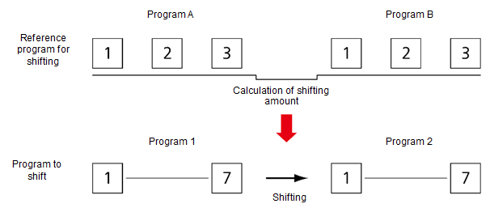

# 4.3.5 Coordinate Shifting

The coordinate shifting function is a function that enables you to create a program without additional teaching even if a workpiece of the same shape, as shown in Image 2, is placed at a different location after a program taught on the workpiece \(Image 1\).

It is required to have three reference points to use the coordinate shifting function. You can create Program A by marking three reference points on the workpiece at the initial position. After moving the position of the workpiece, write Program B using the previously marked three reference points.


* The accuracy of the coordinate shifting program will be affected by the accuracy of teaching the three reference points in coordinate shifting. Perform teaching as accurately as possible for the three reference points.
* Set the distance between the three reference points as far as possible in coordinate shifting.


You can shift the existing program \(Program 1\) to a new program \(Program 2\) by calculating the coordinate shifting amount in three steps that are the basis of Program A and Program B.

