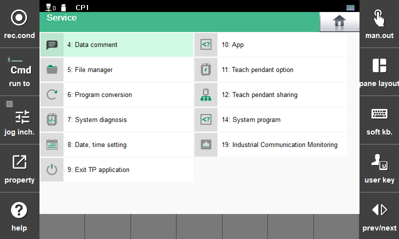

# 4.1 Use of service

1.	In manual or automatic mode, touch the `[service]` button on the function button bar of the initial screen. Various service menus of the program will be displayed.

2.	Selecting the desired menu will enable you to manage files, programs, teach pendants, or to check the status of the robot system.

    

* `4: Data comment`: You can manages comments for input/output variables, relays, and various other variables.
* `5: File Manager`: You can manage files in the main board's internal memory, teach pendant, or removable storage device.
* `6: Program Conversion`: You can convert the data, such as the condition and location of the created program, by batch or individually.
* `7: System Diagnosis`: You can check the status of the robot and controller and update the system version.
* `8: Date, time setting`: You can set the date and time of the controller.
* `9: Exit TP application`: Exit the TP(Teach Pendant) application.
* `10: App`: Manages the software installed and running on the teach pendant.
* `11: Teach pendant option`: Set the sound and screen save time of the teach pendant.
* `12: Teach pendant sharing`: Connect the teach pendant to multiple controllers or to the virtual controllers in HRSpace4.
* `14: System program`: You can view and remove the system programs (e.g. OPC-UA server) installed on the controller.
* `19: Industrial Communication Monitoring`: Monitor firmware information and communication status.
