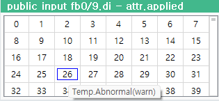
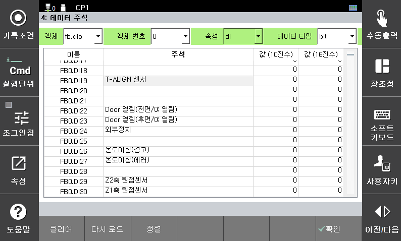
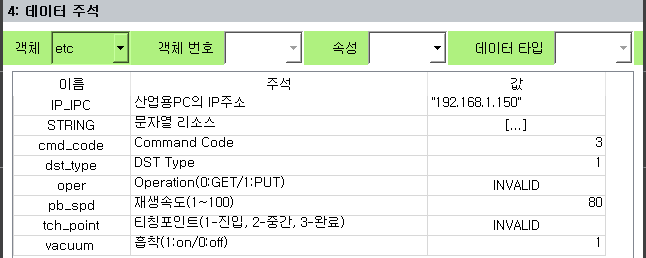
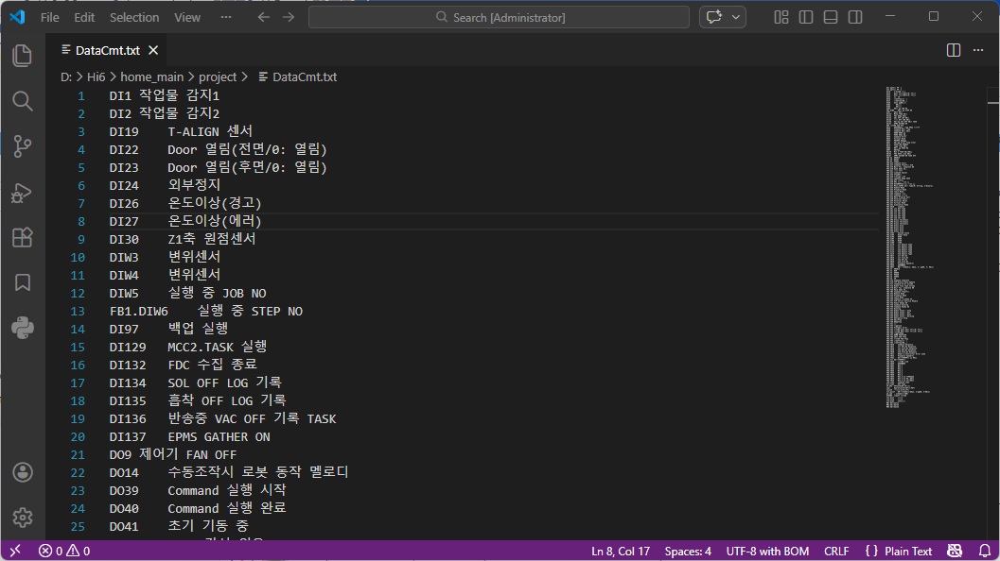

# 4.11 데이터 주석

(이 기능은 V70.01-00 및 이후 버전부터 지원됩니다.)

IO변수, 내장 PLC의 각 릴레이, 기타 일반 변수에 대해 주석을 등록할 수 있습니다. 등록된 주석은 모니터링창에 툴 팁으로 표시됩니다. (`범용 입력`, `범용 출력`, `fn 입력`, `fn 출력`, `전역변수`, `메모리 변수`, `각종 데이터` 모니터링)

또한, 아래 기능들을 사용하여 등록된 주석을 job 프로그램의 각 명령문에 자동으로 입력할 수도 있습니다.

* [4.3.9 명령문 주석](3-program-conversion/9-stmt-comment.md)
* [3.2.4.5 블록 편집 모드](../3-programming/2-prog-edit/4-statement-edit/5-block-edit-mode.md) - `[자동 주석]` 버튼.

이 화면에서 설정된 주석은 메인 모듈의 `project/DataCmt.txt` 파일로 저장됩니다.

### 데이터 주석 화면
   1. `[F1:서비스] - 4: 데이터 주석`을 선택하여 화면을 엽니다.

   2. 상단의 필터 콤보박스들로 원하는 데이터 종류와 타입을 선택합니다.

   3. 선택된 데이터들이 테이블에 나타납니다. 각 항목의 이름과 주석, 현재 값을 볼 수 있습니다.

   4. `fb.dio`, `fn.dio`, `relay` 객체는 모든 인덱스가 표시됩니다. 주석이 등록된 인덱스는 주석이 표시되고, 등록되지 않은 인덱스는 주석 열이 비어 있습니다.

   5. `etc`는 IO와 릴레이를 제외한 나머지, 즉 각종 전역 변수들 중 주석이 등록된 것만 표시합니다. (지역 변수는 서브 job에 따라 의미가 달라질 수 있으므로 주석을 등록하지 마십시오.) 데이터 타입은 해당 변수의 타입에 따라 표시됩니다.
   

### 이동
   1. 상하 화살표키를 눌러 항목을 이동할 수 있습니다. `Ctrl`키와 같이 누르면 더 빠르게 이동합니다.

   2. 혹은, `이름` 열에 숫자키로 인덱스를 입력하여 해당 인덱스로 바로 이동할 수도 있습니다. (`etc` 객체에서는 불가)

   3. 한번에 표시되는 항목 수는 최대 1000개입니다. 따라서, `M` 릴레이 등 이보다 최대 인덱스가 큰 종류는 한번에 볼 수 없습니다. 위 2.의 방법으로 페이지를 바꿔가며 이동해야 합니다.

### 편집, 저장, 불러오기
   1. `주석` 열에 숫자키나 소프트키보드로 주석을 입력, 편집 할 수 있습니다.
   
   2. 등록되어 있는 주석을 제거하고 싶으면, 주석 열의 문자열을 삭제하면 됩니다. (공백 문자열은 미등록으로 간주됩니다.)

   3. `[F7:확인]` 혹은 `[SHIFT]+[F7:적용]`을 누르면, 편집한 내용이 메인 모듈에 반영되고, `DataCmt.txt` 파일에도 저장됩니다.

   4. `[F1:클리어]`를 누르면, 모든 항목이 삭제됩니다. (파일에는 `[F7:확인]`를 눌러야 반영됩니다.)
      
   5. `[F2:다시 로드]`을 누르면, `DataCmt.txt` 파일이 다시 로드되고, TP의 데이터 주석 화면도 갱신됩니다.

   6. `[F3:정렬]`을 누르면, 화면에서는 변화가 없지만, `[F7:확인]`로 저장할 때 정렬된 상태로 저장됩니다. 정렬하지 않고 저장하면, 파일의 기존 순서가 보존됩니다.

   7. 값 열은 편집할 수 없습니다.

### `DataCmt.txt` 파일

   1. 혹은 PC에서 텍스트 편집기를 사용하여 `DataCmt.txt` 파일을 편집할 수도 있습니다. 아래 그림은 파일을 `Visual Studio Code` 로 열어 본 예입니다.
   

   2. 파일은 `tsv(Tab-Separated Values)` 형식입니다. 각각의 행이 1개씩의 이름, 주석 쌍으로 구성됩니다. 이름과 주석 사이는 1개 이상의 탭(tab) 문자로 구분해야 합니다.  

   3. HRLadder의 `릴레이 설명 가져오기`/`릴레이 설명 내보내기` 기능의 파일형식과 호환됩니다. 따라서 작성된 파일은 Hi6/Hi7 제어기, HRLadder 공용으로 사용할 수 있습니다. (Hi5a 제어기와도 호환됩니다. 단, 릴레이명, 변수명의 차이는 조정이 필요합니다.)

   4. IO나 릴레이 이름은 대문자로 된 내장PLC 방식과 소문자로 된 hrscript 방식을 모두 동일하게 인식합니다. (가령, `FB5.DIB3`과 `fb5.dib3`을 동일하 것으로 간주합니다.) 변수의 경우는 대소문자가 정확히 일치해야 합니다.

   5. 비영어 언어의 주석일 경우, 파일의 인코딩 방식은 반드시 UTF8-BOM로 저장하십시오. (영어 주석만 사용할 경우는 ANSI, UTF8-BOM 둘 다 가능)
