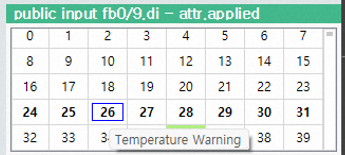
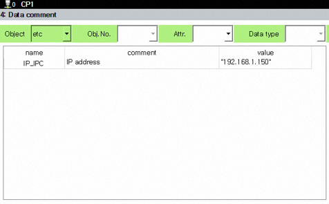

# 4.11 数据注释

(此功能支持从 V70.02-00 版本及更高版本。)

您可以为 IO 变量、内置 PLC 的继电器和其他一般变量注册注释。注册的注释将在监控面板中显示为工具提示。 (`公共输入 (public input)`, `公共输出 (public output)`, `fn 输入 (fn input)`, `fn 输出 (fn output)`, `全局变量 (global variable)`, `内存变量 (memory variable)`, `多种数据 (watch)` 监控)

此外，通过使用以下功能，注册的注释可以自动附加到作业程序的每个语句上。

* [4.3.9 语句数据注释](3-program-conversion/9-stmt-comment.md)
* [3.2.4.5 块编辑模式](../3-programming/2-prog-edit/4-statement-edit/5-block-edit-mode.md) - `[auto comment]` 按钮。

在此屏幕上配置的注释将保存到 `project/DataCmt.txt` 文件中。

### 数据注释屏幕

   1. 选择 `[F1: 服务] - 4: 数据注释 ([F1: Service] - 4: Data comment)` 打开屏幕。

   2. 使用顶部的过滤组合框选择所需的数据类别和类型。

   3. 所选数据将以表格形式显示。您可以查看每个项目的名称、注释和当前值。

   4. 对于 `fb.dio`、`fn.dio` 和 `relay` 对象，所有索引都会显示。具有注册注释的索引将显示注释，而没有注册的索引将有一个空的注释字段。

   5. `etc` 仅显示各种全局变量中具有注册注释的项目（排除 IO 和继电器）。(不要为局部变量注册注释，因为它们的含义可能因子作业而异。) 数据类型根据变量类型显示。

### 导航

   1. 您可以通过按 `上 (Up)`/`下 (Down)` 箭头键在项目之间移动。按住 `Ctrl` 键时按下可以更快地移动。

   2. 或者，您可以直接在 `名称 (Name)` 列中输入数字以跳转到特定索引。(注意：此功能不适用于 `etc` 对象。)

   3. 最多可以同时显示 1,000 个项目。对于具有更大最大索引的类型（例如 ` (M)`-继电器），您不能在一个屏幕上查看所有内容。必须使用上述方法通过页面进行导航。

### 编辑、保存和加载

   1. 您可以使用数字键盘或软键盘在 `注释 (Comment)` 列中输入或编辑注释。

   2. 要删除现有的注释，只需删除注释列中的文本。（空字符串被视为未注册。）

   3. 按下 `[F7: 确定] ([F7: OK])` 或 `[SHIFT]+[F7: 应用]` 将把您的编辑应用于主模块并将其保存到 `DataCmt.txt` 文件中。

   4. 按下 `[F1: 初始化] ([F1: 清除])` 将删除所有项目。（更改仅在按下 `[F7: 确定] ([F7: OK])` 后在文件中反映。）

   5. 按下 `[F2: 重新加载] ([F2: Reload])` 重新加载 `DataCmt.txt` 文件并刷新 TP 上的数据注释屏幕。

   6. 按下 `[F3: 排序] ([F3: Sort])` 将不会更改当前屏幕显示，但当您按下 `[F7: 确定] ([F7: OK])` 时，数据将以排序状态保存。如果您在不排序的情况下保存，文件中的原始顺序将被保留。

   7. 值列无法编辑。

### `DataCmt.txt` 文件

   1. 或者，您可以使用文本编辑器直接在 PC 上编辑 `DataCmt.txt` 文件。下面的图片显示了在 `Visual Studio Code` 中打开该文件的示例。

      

   2. 文件采用 `tsv (Tab-Separated Values)` 格式。每行由名称和注释对组成。名称和注释必须用至少一个制表符分隔。

   3. 文件格式与 HRLadder 中的 `导入继电器描述` / `导出继电器描述` 功能兼容。因此，创建的文件可以在 Hi6/Hi7 控制器和 HRLadder 之间交替使用。(它也与 Hi5a 控制器兼容；不过，继电器或变量名称的差异可能需要进行调整。)

   4. 对于 I/O 或继电器名称，系统将内置 PLC 样式（大写）和 hrscript 样式（小写）视为相同。(例如，`FB5.DIB3` 和 `fb5.dib3` 被视为相同.) 但对于变量，区分大小写必须完全匹配。

   5. 如果注释包含非英语字符，则文件编码必须保存为 UTF8-BOM。（如果只使用英语注释，则 ANSI 和 UTF8-BOM 都可以接受。）