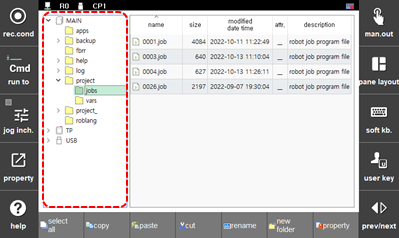
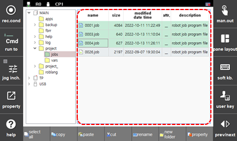
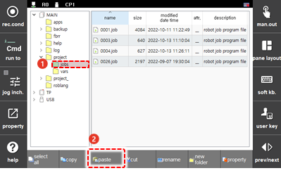
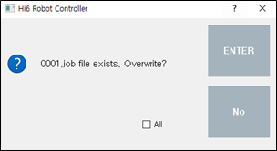
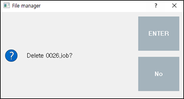

# 4.2.1 File Management

Select one or multiple files to copy, move, or delete.

1.	Select a folder in the folder list using the jog dial on the teach pendant. A list of files saved in the selected folder will appear.

    

2.	Select the desired file in the file list by touching it.

    

* You can select multiple files one by one by touching each file while pressing the <**CTRL**> key.
* If you touch two files while pressing the <**SHIFT**> key, you can select all files between the two files at once.
* If you touch the \[Select All\] button on the function button bar of the screen, you can select all files at once.

  Press the <**ESC**> key to cancel the file selection.

3.	You can copy, move, or delete the selected file using the function buttons on the function button bar of the screen.

* \[Copy\]: Copy the selected file and save it in a temporary folder so that it can be pasted into another folder.
* \[Paste\]: You can paste the file saved in the clipboard to the desired folder. 
* \[Cut\]: You can cut the selected file and save it in a temporary folder so that it can be pasted into another folder. 
* \[Delete\]: You can delete the selected file. A protected file \(with the protection mark \(W\_\) in the attributes\) cannot be deleted.

4.	To paste a file into a folder, select the folder using the jog dial and then touch the \[Paste\] button. Then, the file will be pasted to the selected folder.

    

* If the selected folder has a file with a duplicate name, a duplication notification window will appear. Handle it by setting whether to overwrite it.

    

* To delete a file, touch the \[Delete\] button, and then touch the \[ENTER\] button in the confirmation window.

    

