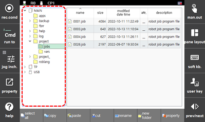
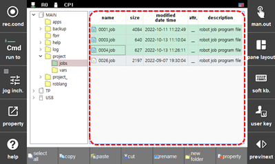
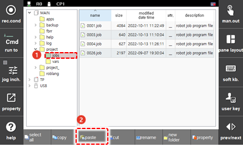
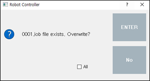
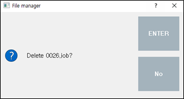

# 4.2.1 文件管理

选择一个或多个文件进行复制、移动或删除。

1. 使用教学手柄上的 Jog Dial 选择文件夹列表中的一个文件夹。将出现选定文件夹中保存的文件列表。

    

2. 通过触摸文件列表中的所需文件进行选择。

    

* 您可以按住 `[CTRL]` 键逐个选择多个文件。
* 如果您在按住 `[SHIFT]` 键时触摸两个文件，可以一次性选择这两个文件之间的所有文件。
* 如果您在屏幕功能按钮栏上触摸 `[Select All]` 按钮，可以一次性选择所有文件。

  按 `[ESC]` 键取消文件选择。

3. 您可以使用屏幕功能按钮栏上的功能按钮复制、移动或删除选定的文件。

* `[Copy]`：复制所选文件并保存到临时文件夹，以便可以粘贴到另一个文件夹中。
* `[Paste]`：您可以将保存在剪贴板中的文件粘贴到所需文件夹。
* `[Cut]`：您可以剪切所选文件并保存到临时文件夹，以便可以粘贴到另一个文件夹中。
* `[Delete]`：您可以删除所选文件。受保护的文件（在属性中带有保护标记 \(W\_\)）无法被删除。

4. 要将文件粘贴到文件夹中，使用 Jog Dial 选择文件夹，然后触摸 `[Paste]` 按钮。然后，文件将粘贴到所选文件夹中。

    

* 如果所选文件夹中有文件名称重复，将出现重复通知窗口。通过设置是否覆盖来处理。

    

* 要删除文件，触摸 `[Delete]` 按钮，然后在确认窗口中触摸 `[ENTER]` 按钮。

    