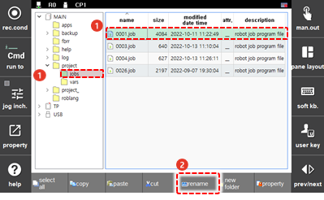
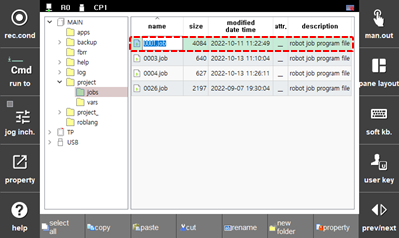
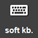

# 4.2.2 Renaming of a File and Folder

You can rename a file or folder. You can also rename multiple files or folders at once.

1.	Touch the desired file \(or folder\) in the file \(or folder\) list to select it, and then touch the \[rename\] button on the function button bar of the screen.

    

2.	Input the file \(or folder\) name in the input area.

    

* You can input the number simply by using the operation keys on the teach pendant. \(&lt;←/→&gt; keys: For moving the cursor. Number keys: For inputting a number\)
* To input a text including numbers, touch the \[  \] button on the log bar to use the soft keyboard.

3.	Press the <<b>ENTER</b>> key. Then, the new name you inputted in the list will appear.


* You can also rename a protected file.
* 
  Even if a file is renamed, the information such as size, modified date, and attributes will remain the same as before.

* 
  It is the same function as “R116 Program Number Change” of R codes.



