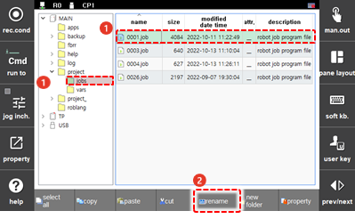
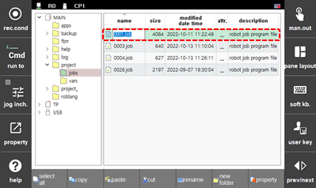
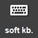

# 4.2.2 文件和文件夹重命名

您可以重命名文件或文件夹。您还可以一次重命名多个文件或文件夹。

1. 在文件（或文件夹）列表中触摸所需的文件（或文件夹）以选择它，然后触摸屏幕功能按钮栏上的 `[rename]` 按钮。

    

2. 在输入区域输入文件（或文件夹）名称。

    

* 您可以通过使用教学挂件上的操作键简单输入数字。 (`[←/→]` 键：用于移动光标。数字键：用于输入数字)
* 要输入包含数字的文本，请触摸日志栏上的  按钮以使用软键盘。

3. 按 `[ENTER]` 键。然后，您在列表中输入的新名称将出现。


* 您还可以重命名受保护的文件。
* 
  即使文件被重命名，大小、修改日期和属性等信息也将保持不变。

* 
  这是与 R 代码的 "R116 程序编号更改" 相同的功能。

