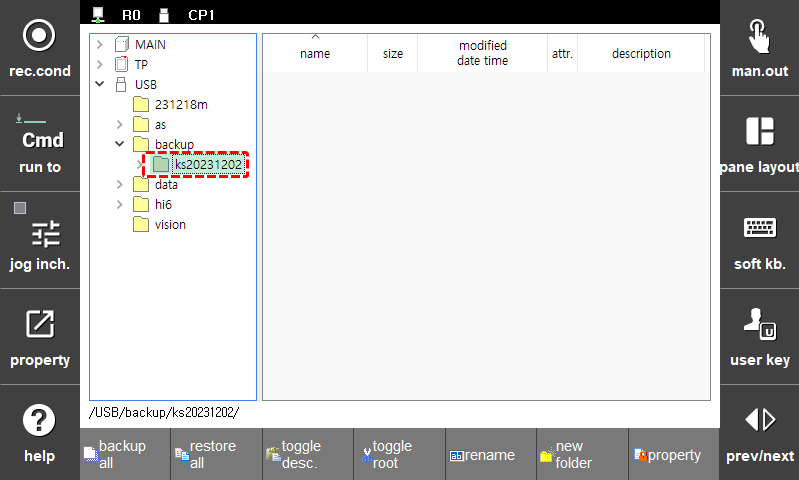

# 4.2.3.1 Folder Deletion

1.	Select a folder in the folder list using the jog dial on the teach pendant and then touch the  key of the key pad.

    

2.	In the confirmation window, touch the \[ENTER\] button. The selected folder and all files saved in it will be deleted.

    

